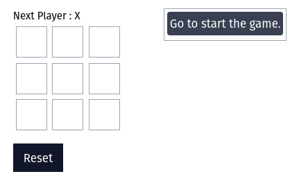
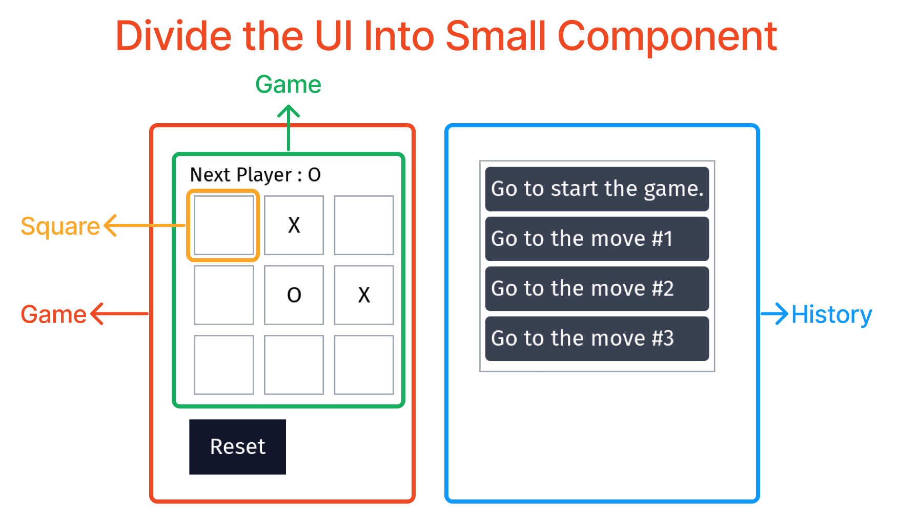
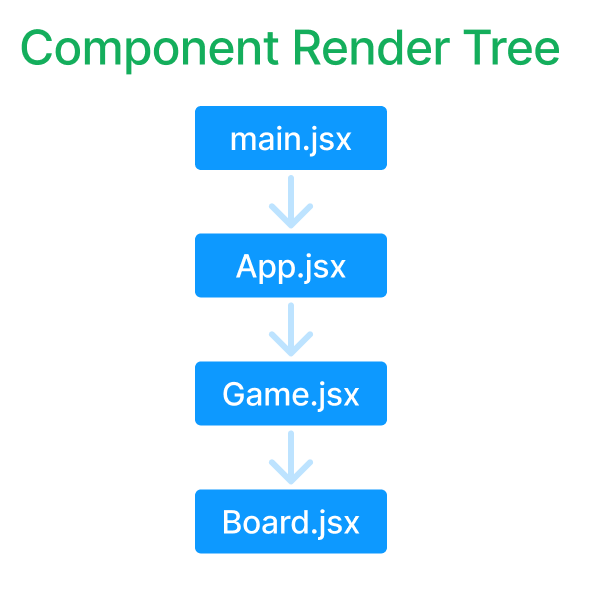
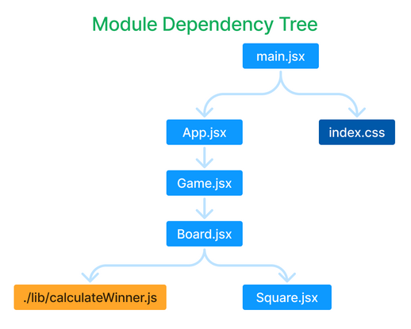

# Tic Toc Toe

This project from module 1, video no 1.13. Also I refactored the code later and add two more feature.

## 🎥 Live Link

|  |
| --------------------------------------------------------------------------------------------------------------------------------------------------------------------------- |
| 
[ Go to Site >](https://rnext-mini-practice-project-tic-toc-toe.vercel.app/ "🚀 rnext-mini-practice-project-tic-toc-toe")
                             |

## 🖥️ Divide the UI Into Small Component

## 🌲 Render Tree

## 🌳 Module Dependency Tree

## ✒️ What Feature I add Later

- Display game draw if no one is winner.
- Adding reset button.

## 📝 Important Note From The Video

**Tapas sir tell us some important rules. That was :**

- Requirement Analysis
  - Break the requirement into small pieces.
  - Connect the pieces.
- Take some break in middle of project for represhing mind.
- If any question then take note down.
